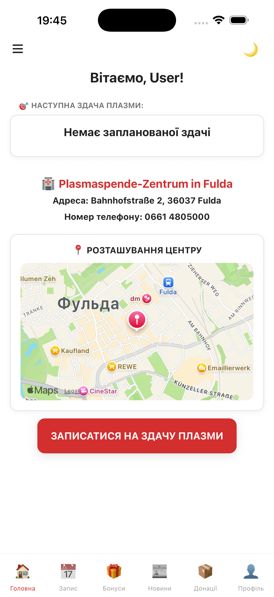
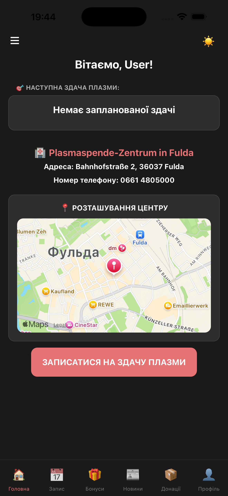
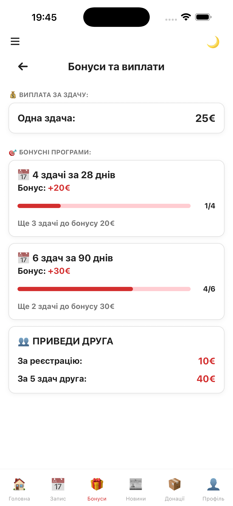
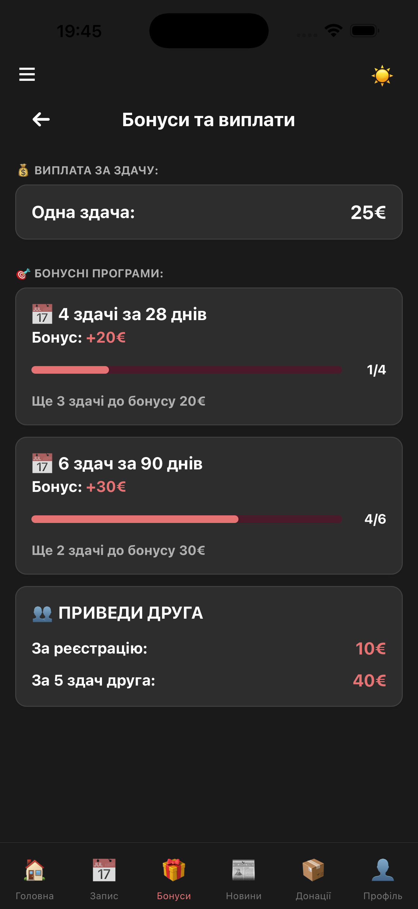
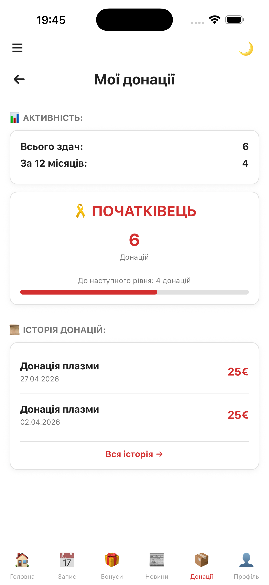
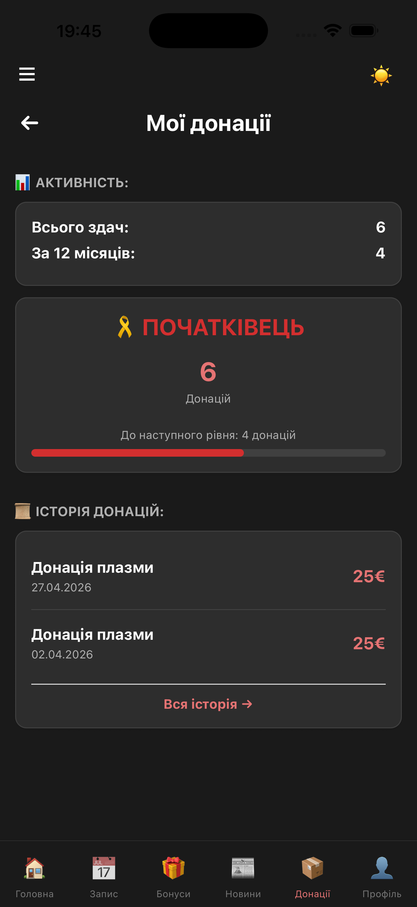
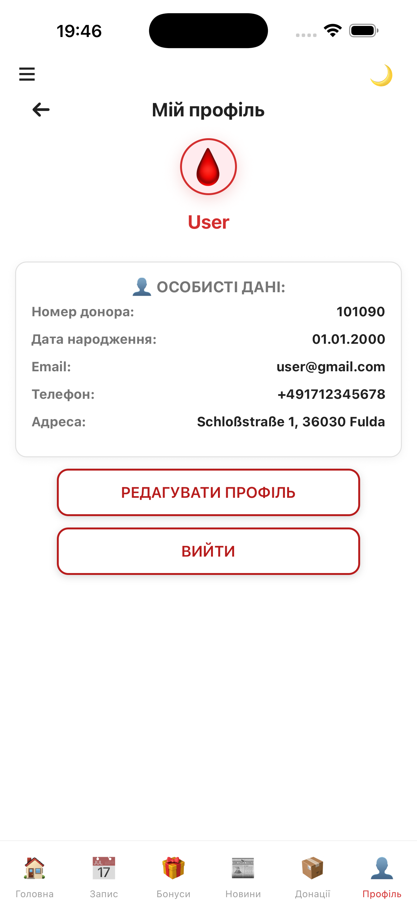
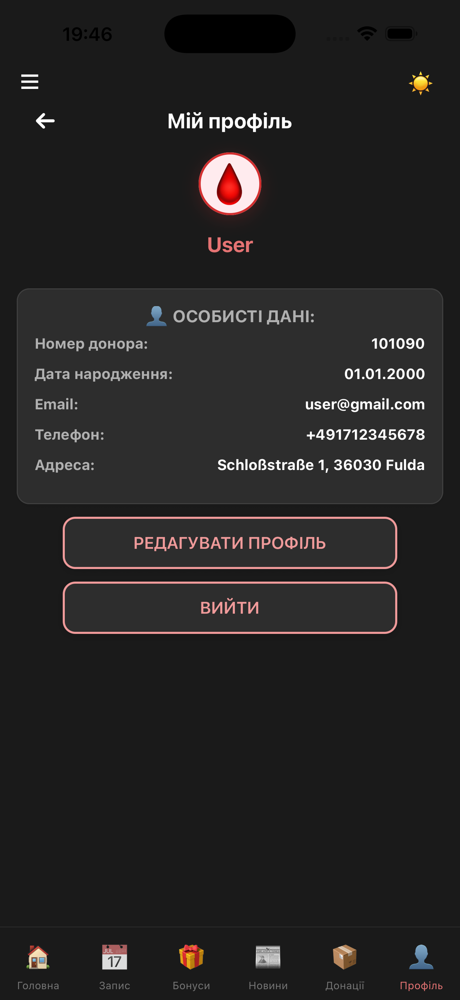
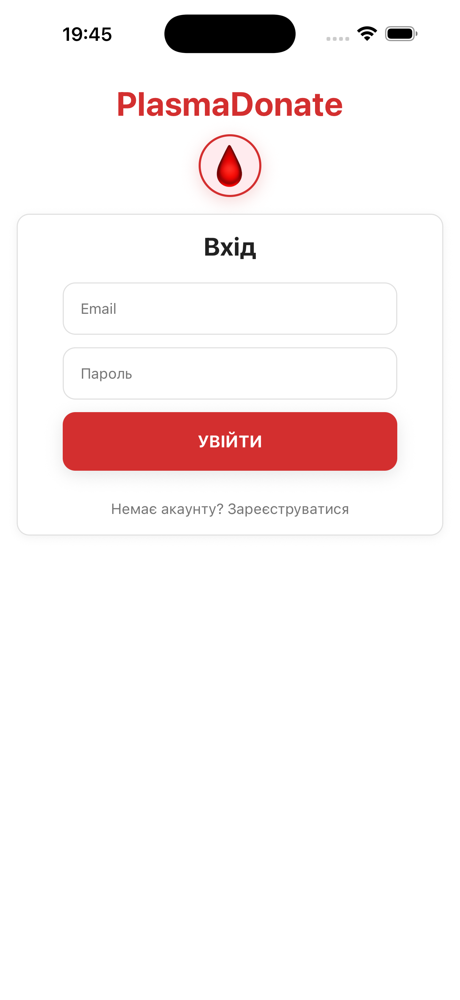
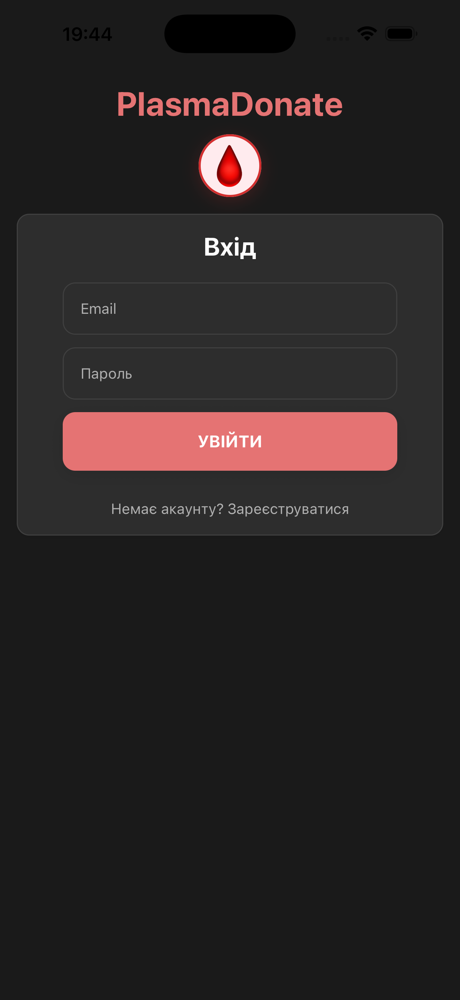

# 🩸 PlasmaDonate — Фінальний проєкт (Cross-Platform Development)

> **Автор:** Подпоріна Ніна  
> **Дисципліна:** Cross-Platform Development  
> **Рік:** 2026

---

# 📱 Про застосунок

**PlasmaDonate** — мобільний застосунок для донорів плазми крові.

Основна мета застосунку — спростити процес запису на донацію, допомогти користувачам відстежувати історію своїх донацій та мотивувати донорів через бонусну систему.

Застосунок дозволяє:
- записуватися на донацію плазми;
- переглядати історію донацій;
- отримувати бонуси за регулярність;
- відстежувати прогрес досягнень;
- переглядати карту донорського центру;
- керувати запланованими записами.

---

# 🛠 Використані технології

- React Native
- Expo
- TypeScript
- Redux Toolkit
- React Navigation
- react-native-maps
- dayjs
- React Native Reanimated

---

# 🔍 Завдання 1. Аналіз існуючого застосунку

Перед початком виконання фінального проєкту було проведено аналіз початкової версії застосунку.

## Що вже було реалізовано

- базова навігація між екранами;
- форма запису на донацію;
- підтримка світлої та темної теми;
- базові UI-компоненти;
- анімація ZoomIn для карток новин.

## Виявлені зони для покращення

### 1. Відсутність динамічної бонусної системи

У початковій версії бонуси були статичними та не розраховувалися автоматично.

### 2. Відсутність історії донацій

Користувач не мав можливості переглядати попередні донації або керувати записами.

### 3. Відсутність інтерактивної карти

У застосунку не було карти донорського центру.

### 4. Недостатнє глобальне керування станом

Частина даних не зберігалася централізовано.

---

# 🚀 Завдання 2. Розширення функціоналу

## 1. Динамічна бонусна система — НОВИЙ ФУНКЦІОНАЛ

### Було

- статичні значення бонусів;
- прогрес не перераховувався автоматично.

### Стало

- бонуси розраховуються динамічно;
- враховується кількість донацій за останні 28 та 90 днів;
- автоматично визначається прогрес до наступного бонусу;
- використано `useMemo` для оптимізації.

---

## 2. Карта донорського центру — НОВИЙ ФУНКЦІОНАЛ

### Було

- карта була відсутня.

### Стало

- додано інтерактивну карту через `react-native-maps`;
- відображається маркер донорського центру;
- реалізована підтримка Web-заглушки.

---

## 3. Історія донацій — НОВИЙ ФУНКЦІОНАЛ

### Було

- історія донацій була відсутня.

### Стало

- додано `DonationHistoryScreen`;
- додано `FullHistoryScreen`;
- реалізовано перегляд повної історії.

---

## 4. Управління записом на донацію — НОВИЙ ФУНКЦІОНАЛ

### Реалізовано

- збереження запланованої донації у Redux (`scheduled`);
- скасування запису через модальне вікно;
- перенесення запису (навігація на екран запису).

---

## 5. Анімація модального вікна — НОВА АНІМАЦІЯ

У `DonationHistoryScreen.tsx` додано модальне вікно з анімацією `fade`:
- плавне з'явлення;
- затемнення фону.

---

## 6. Компонент рейтингу донора — НОВИЙ КОМПОНЕНТ

Створено окремий компонент `DonorRating.tsx` з рівнями:
- 🎗 Початківець
- 🥉 Бронзовий донор
- 🥈 Срібний донор
- 🥇 Золотий донор
- 🏆 Платиновий донор

---

## 🧠 Керування станом

### Redux Toolkit (РОЗШИРЕНО)

У порівнянні з початковою версією до Redux додано:
- історія донацій (`history`);
- заплановані записи (`scheduled`);
- нові reducers: `scheduleDonation`, `cancelScheduledDonation`, `completeDonation`, `addToHistory`.

**Чому Redux:** складна логіка обробки даних, використання на багатьох екранах.

---

## 🧩 Компонентний підхід

Усі UI-компоненти винесені в окремі файли.

### Структура компонентів

```bash
components/
├── Card.tsx
├── CustomHeader.tsx
├── CustomInput.tsx
├── DonorRating.tsx      
├── OutlineButton.tsx
├── PlasmaIcon.tsx
├── PrimaryButton.tsx
├── ScreenContainer.tsx
└── SmallButton.tsx
```

---

# 🎨 Завдання 3. Покращення UX/UI

## Реалізовано

- кастомні компоненти;
- адаптивний інтерфейс;
- анімація fade для модального вікна.

---

## 🧭 Навігація

У застосунку використовується React Navigation.

### Реалізовано сценарії:
- Home → Donate
- History → FullHistory
- Donate → Confirmation (з скиданням навігації)

---

# ⚡ Оптимізація продуктивності

| Оптимізація | Результат |
|---|---|
| `React.memo` для `Card.tsx` | оптимізація ререндерів |
| `useCallback` в `HomeScreen` | мемоізація обробників |
| `useMemo` в `BonusesScreen` | оптимізація розрахунку бонусів |
| `moment.js` → `dayjs` | зменшення розміру застосунку |

---

# 📂 Структура проєкту

```bash
plasmadonate/
├── src/
│   ├── api/
│   ├── components/
│   ├── constants/
│   ├── navigation/
│   ├── screens/
│   ├── store/
│   └── App.tsx
├── screenshots/          
├── video/                
├── package.json
├── tsconfig.json
├── README.md
└── PlasmaDonate.pdf 
```

---

# 📸 Скріншоти застосунку

| Екран | Light | Dark |
| :--- | :--- | :--- |
| Головний |  |  |
| Бонуси |  |  |
| Історія донацій |  |  |
| Профіль |  |  |
| Логін |  |  |

---

# 🎥 Анімації

## 📰 News Feed Animation (ZoomIn)
- [news-animation-dark.mov](video/news-animation-dark.mov)
- [news-animation-light.mov](video/news-animation-light.mov)

## 📋 Donation History Modal Animation (fade)
- [donation-history-animation-dark.mov](video/donation-history-animation-dark.mov)
- [donation-history-animation-light.mov](video/donation-history-animation-light.mov)

---

# 🔮 Майбутні покращення

- push-сповіщення;
- авторизація користувача;
- інтеграція Firebase;
- геолокація найближчих центрів.

---

# ✅ Відповідність критеріям фінального проєкту

| Критерій | Статус |
|---|---|
| Аналіз застосунку | ✅ |
| Розширення функціоналу | ✅ |
| Redux / Context API | ✅ |
| Компонентний підхід | ✅ |
| UX/UI покращення | ✅ |
| Навігація | ✅ |
| Документація | ✅ |
| Презентація | ✅ |

---

# 🚀 Запуск проєкту

```bash
npm install
npx expo start
```

---

# 🔗 GitHub Repository

🔗 https://github.com/N1nochka/Podporina_cross_final_project

---

# 🎯 Висновок

У процесі виконання фінального проєкту застосунок PlasmaDonate був значно вдосконалений:

- додано нові функції (динамічні бонуси, карта, історія донацій);
- розширено Redux (history, scheduled);
- створено нові компоненти (DonorRating);
- додано анімацію fade для модального вікна;
- проведено оптимізацію (memo, useCallback, useMemo, dayjs).

Застосунок став більш масштабованим та зручним для користувача.
